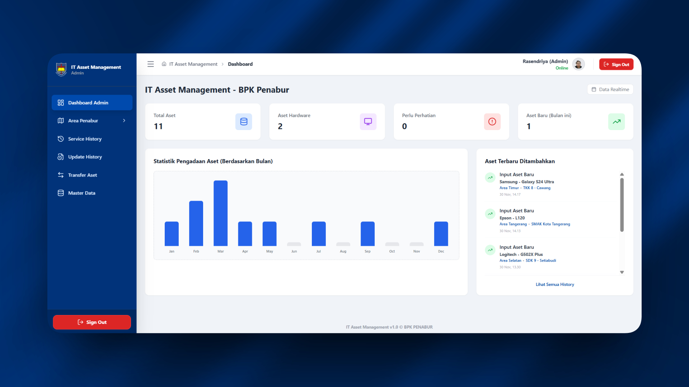
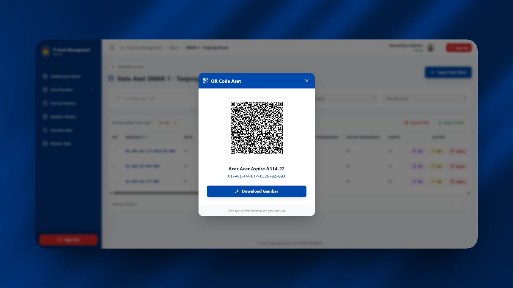

# 🏫 IT Asset Management System - BPK PENABUR


Sistem Informasi Manajemen Aset IT berbasis web yang dirancang untuk memodernisasi pengelolaan inventaris di lingkungan sekolah BPK PENABUR. Sistem ini menggantikan pencatatan manual dengan solusi digital yang terintegrasi, _real-time_, dan mendukung mobilitas tinggi dengan fitur QR Code.

> **Project Magang / Internship** - Rafi Rasendriya (Universitas Bina Sarana Informatika)

---

## 📸 Tampilan Aplikasi

|              **Dashboard Admin**               |      **Mobile View & QR Scan**       |
| :--------------------------------------------: | :----------------------------------: |
|  |   |
|  _Statistik aset realtime & grafik pengadaan_  | _Akses mudah bagi operator lapangan_ |

---

## 🔥 Fitur Utama

- **🔐 Multi-Role Authentication:** Hak akses terpisah untuk Admin, Operator, dan User (IT Support).
- **📊 Real-time Dashboard:** Visualisasi data total aset dan grafik pengadaan.
- **📱 QR Code Integration:** Generator & Scanner QR Code untuk identifikasi aset instan.
- **🛠 Service History:** Pencatatan riwayat perbaikan dan pemeliharaan aset.
- **🔄 Asset Transfer:** Fitur mutasi aset antar sekolah/ruangan dengan Log Audit otomatis.

---

## 🛠️ Teknologi (Tech Stack)

- **Frontend:** React.js (Vite), Tailwind CSS, Axios.
- **Backend:** Python FastAPI, SQLAlchemy, Pydantic.
- **Database:** PostgreSQL.
- **Tools:** Visual Studio Code, Git.

---

## 🚀 Cara Menjalankan Project (Panduan Instalasi)

Panduan ini untuk pengguna yang ingin mencoba menjalankan project ini di komputer lokal (Localhost).

### 1. Clone Repository

```bash
git clone https://github.com/Rasendriya515/it-asset-management-bpk-penabur.git
cd it-asset-management-bpk-penabur

cd backend
# Install Dependencies
pip install -r requirements.txt

# Jalankan Server Backend
uvicorn app.main:app --reload --port 8000

cd frontend
# Install Dependencies
npm install

# Jalankan Server Frontend
npm run dev

📂 Struktur Database (ERD)
Sistem ini menggunakan 7 tabel utama yang saling berelasi untuk menyimpan data operasional:

Users: Data pengguna (Admin/Operator).

Assets: Data inventaris utama (Laptop, PC, dll).

Schools & Areas: Data lokasi dan wilayah sekolah.

ServiceHistories: Riwayat perbaikan aset.

UpdateLogs: Audit trail perubahan data.

👤 Author
Rafi Rasendriya

Mahasiswa Ilmu Komputer - UBSI

Intern at BPK PENABUR (2025)
```
